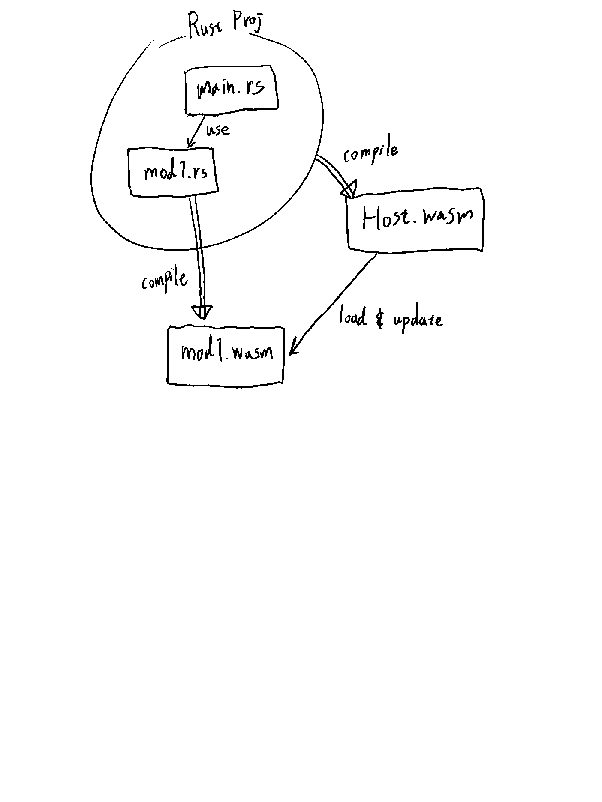

# rust-hmr-experiment

Rust Web Dev;
Proof of Concept for HMR (Hot Module Replacement) using WASM modules.

## Brief Roadmap

- [x] compile whole cargo project into WASM (main module)
- [x] Compile a single rust file into a separate WASM file (component module)
- [ ] Load the component WASM module (`mod1.wasm`) from main WASM module
  - [x] Import object: `__wbindgen_placeholder__`, `__wbindgen_externref_xform__` fields
  - [x] Use of [Proxy](https://developer.mozilla.org/en-US/docs/Web/JavaScript/Reference/Global_Objects/Proxy) in JS to flexibly resolve the importObject for WASM instanciation
  - [ ] **Issue**: `getStringFromWasm0` refers the address of wrong wasm memory (the host wasm memory)
- Workarounds
  - Plan A
    - [x] Compile `mod1.rs` into object file with `--emit obj` flag in `rustc`
    - [x] Modify the wasm binary with [Walrus](https://github.com/rustwasm/walrus)
    - [ ] pass in the original host's memories and imports to instanciate `mod1.wasm`
      - so it can use the shared js glue codes
  - Plan B
    - generate separate js glue code using [wasm-bindgen-cli-support](https://docs.rs/wasm-bindgen-cli-support/latest/wasm_bindgen_cli_support/index.html)
    - 
- [ ] HMR (without Leptos)
- [ ] HMR (with Leptos)
- [ ] rust source modifier plugin (for activating HMR thru plugin interface)
