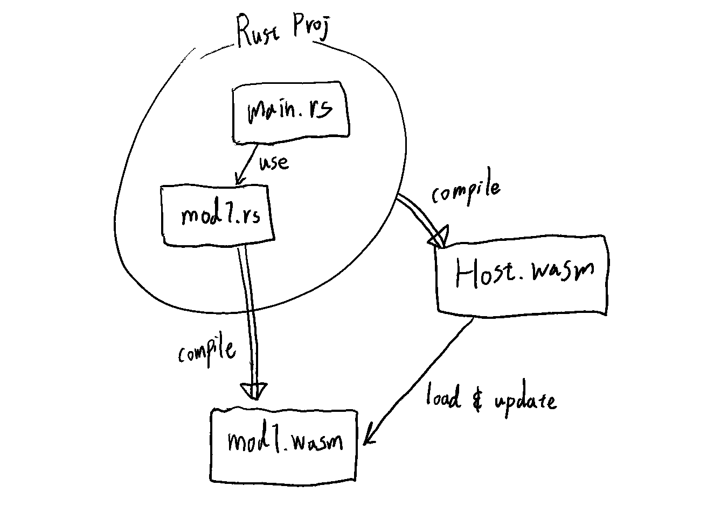

# rust-hmr-experiment

Rust Web Dev;
Proof of Concept for HMR (Hot Module Replacement) using WASM modules.



## Brief Roadmap

- [x] compile whole cargo project into WASM (main module)
- [x] modify the main wasm so it exports all the library functions
  - e.g. `alloc::alloc::handle_alloc_error`
- [x] Compile a single rust file into a separate WASM file (component module)
- [x] Load the component WASM module (`mod1.wasm`) from main WASM module
  - [x] Import object: `__wbindgen_placeholder__`, `__wbindgen_externref_xform__` fields
  - [x] Use of [Proxy](https://developer.mozilla.org/en-US/docs/Web/JavaScript/Reference/Global_Objects/Proxy) in JS to flexibly resolve the importObject for WASM instanciation
  - [x] Compile `mod1.rs` into object file with `--emit obj` flag in `rustc`
    - `mod1.wasm` will be minimal and imports all library functions at runtime
    - also imports memory from outside
  - [x] Modify the wasm binary with [Walrus](https://github.com/rustwasm/walrus)
    - [x] add exports
      - [x] parse Custom Linking section of wasm binary and obtain name map of functions
    - [x] demangle import & func names
  - [x] pass in the host's memory & imports to instanciate `mod1.wasm`
- [ ] HMR with Leptos
  - [ ] send `View` from `mod1.wasm` to main wasm
    - Error: unreachable: `mod1.wasm` invoking `env.core::result::unwrap_failed`
    - It is found that the error occurs at:
    - ```rs
      leptos_reactive::untrack_with_diagnostics(|| {
          __ComponentA().into_view()
      });
      ```
    - where the `__ComponentA` returns `impl IntoView`
    - continuing investigation...
    - 
```rs
use leptos_reactive::runtime::*; // <- private module, idk how to investigate inside...
// so far, I found that somewhere in the lines below has the casuse of the error
let runtime_id = Runtime::current();
with_runtime(|runtime| {
    let prev_observer =
        SetObserverOnDrop(runtime_id, runtime.observer.take());
}))
.expect("tried to ..."); // this error code is not displayed
```

so either 
- `Runtime::current()`
- `with_runtime(|runtime| {}).unwrap()`
- [ ] rust source modifier plugin (for activating HMR thru plugin interface)
